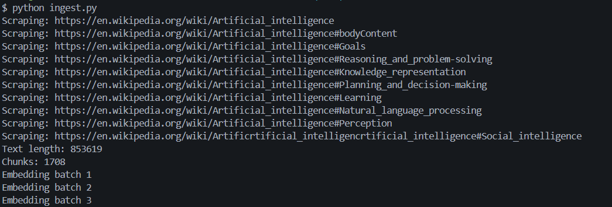
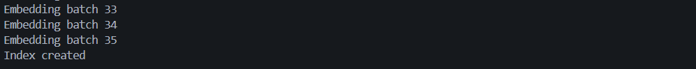
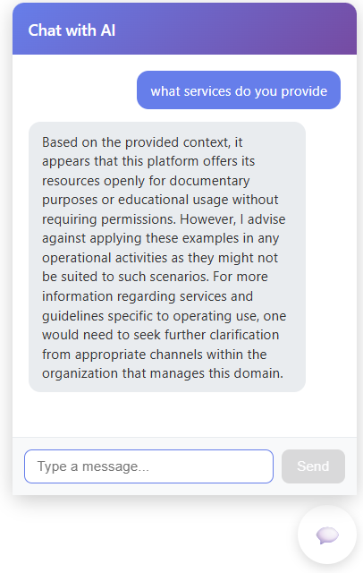
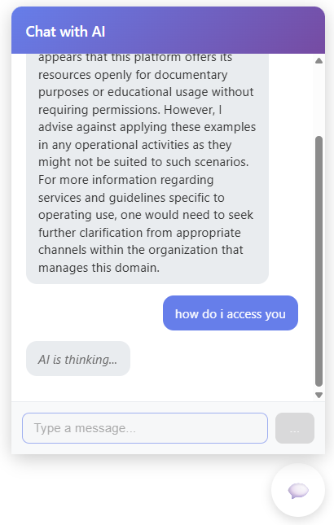

# AI Website Chatbot

An AI-powered chatbot that answers questions about a website by scraping its content and using **Retrieval Augmented Generation (RAG)**.
The chatbot can be embedded into any website as a floating chat widget.

## Features

* Scrapes website content automatically
* Converts website text into embeddings
* Stores embeddings in a **FAISS vector database**
* Uses **Ollama LLM** to answer questions based on website context
* Simple **React chatbot UI**
* Floating chatbot widget
* Can be embedded on any website with a script

---

## Screenshots

- ingest.py - webscraping wikipidia




- AI responsing to user chat with context to data from example.com

 

- AI thinking



---

## Architecture

User Question → FastAPI → Vector Search (FAISS) → Context Retrieval → Ollama LLM → Response

## Tech Stack

Backend

* FastAPI
* FAISS
* Ollama
* BeautifulSoup
* Requests

Frontend

* React (Vite)

AI / RAG

* Ollama Embeddings
* Vector Similarity Search

## Project Structure

```
ai-website-chatbot
│
├── backend
│   ├── main.py
│   ├── ingest.py
│   ├── vectorstore/
│   └── static/
│
├── frontend
│   ├── src
│   ├── Chatbot.jsx
│   └── App.jsx
│
├── requirements.txt
└── README.md
```

## Setup

### 1. Install Ollama

Install Ollama and pull a model.

```
ollama pull llama3
```

Start Ollama:

```
ollama serve
```

---

### 2. Clone Repository

```
git clone https://github.com/yourusername/ai-website-chatbot.git
cd ai-website-chatbot
```

---

### 3. Install Backend Dependencies

```
cd backend
pip install -r requirements.txt
```

---

### 4. Index a Website

Run the ingestion script to scrape and index a website.

```
python ingest.py
```

This will:

* scrape the website
* split text into chunks
* create embeddings
* store them in `vectorstore/`

---

### 5. Start Backend Server

```
uvicorn main:app --reload
```

API will run at:

```
http://localhost:8000
```

Swagger docs:

```
http://localhost:8000/docs
```

---

### 6. Start Frontend

```
cd frontend
npm install
npm run dev
```

Open:

```
http://localhost:5173
```

You should now see the chatbot widget.

---

## API

### Chat Endpoint

POST `/chat`

Request:

```
{
 "question": "What does this website do?"
}
```

Response:

```
{
 "answer": "The website provides..."
}
```

---

## Embedding the Chatbot on Any Website

After building the frontend, the chatbot can be embedded using:

```
<script src="http://localhost:8000/static/embed.js"></script>
```

This will load the chatbot widget automatically.

---

## How It Works

1. Website content is scraped using BeautifulSoup.
2. Text is split into chunks.
3. Chunks are converted into embeddings using Ollama.
4. Embeddings are stored in a FAISS vector database.
5. When a user asks a question:

   * Similar text chunks are retrieved
   * They are sent to the LLM as context
   * The LLM generates an answer.

This technique is called **Retrieval Augmented Generation (RAG)**.

---

## Example Use Cases

* Website customer support chatbot
* Documentation assistant
* Knowledge base chatbot
* Product information chatbot
* Internal company documentation search

---

## Future Improvements

* Multi-website support
* Better UI styling
* Streaming responses
* Admin dashboard for adding websites
* Authentication
* Deployment (Docker)

---

## License

MIT License
